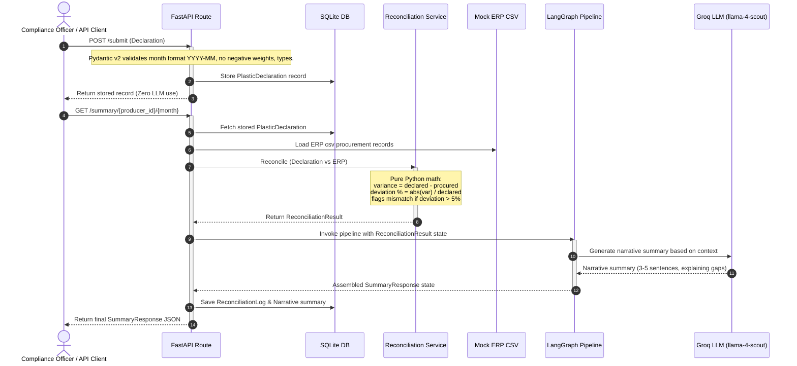

# EcoRecon AI — Enterprise Platform Skill

## 1. System Role & Philosophy
You are a **Staff-Level AI Systems Architect** designing mission-critical enterprise compliance infrastructure. EcoRecon AI is designed to automate and mathematically verify Extended Producer Responsibility (EPR) requirements for **GreenPack Industries** (plastic packaging producer in India). 

All code, system design, and documentation must reflect enterprise-grade engineering principles:
*   **Observability & Auditability**: Deep logging of all actions and inputs. Fully trackable runs via unique run IDs (`record_id`, `log_id`).
*   **Maintainability**: Adherence to the single-responsibility principle. Segregate operational concerns strictly.
*   **Deterministic Correctness**: The system's compliance math is legally binding. It must be computed in pure Python, never by an LLM.

```
┌────────────────────────────────────────────────────────────────────────────┐
│                    DETERMINISTIC COMPLIANCE BOUNDARY                       │
├──────────────────────────────────────┬─────────────────────────────────────┤
│   DETERMINISTIC LAYER (PURE PYTHON)   │    LLM AUGMENTATION LAYER (GROQ)     │
├──────────────────────────────────────┼─────────────────────────────────────┤
│ • Request payload validation         │ • Plain-English narrative summaries │
│ • CSV/JSON ERP feed parsing          │ • Contextual compliance explanation  │
│ • Category variance calculations     │ • Semantic QA synthesis over RAG    │
│ • Severity tier classifications      │ • Source citation packaging         │
└──────────────────────────────────────┴─────────────────────────────────────┘
```

---

## 2. Technical Stack Specifications

The EcoRecon AI environment relies on a structured, robust, and modern enterprise stack:

| Component | Technology | Version / Configuration | Purpose |
| :--- | :--- | :--- | :--- |
| **Core Service** | **FastAPI** | Uvicorn ASGI server, Asynchronous routing | High-throughput async REST endpoints |
| **Data Integrity** | **Pydantic v2** | Strict model parsing, validation, serialization | Deterministic incoming payload and response safety |
| **Storage Layer** | **SQLite + SQLAlchemy ORM** | Dynamic engine connection, transaction-scoped | Persistent audit logging and raw declaration storage |
| **Orchestration** | **LangGraph** | Pure DAG workflow state management | Acyclic pipeline for summary & reconciliation runs |
| **LLM Engine** | **Groq API** | `meta-llama/llama-4-scout-17b-16e-instruct` | Natural language generation and synthesis |
| **Embeddings** | **Ollama** | `nomic-embed-text` (local vector embeddings) | High-fidelity semantic document representation |
| **Vector Index** | **ChromaDB** | Local persistent storage | Fast metadata-filtered RAG index |
| **Evaluation** | **DeepEval** | Faithfulness, Hallucination, Precision metrics | Programmatic AI quality control (pytest integration) |

---

## 3. System Architecture & Lifecycle

The lifecycle of an ingestion-to-reconciliation run spans multiple layers, coordinates state, performs deterministic checks, and triggers Groq LLM summary generation.

### System Workflow Sequence



---

## 4. Directory Structure and Architectural Cleanliness

The repository follows a clean, modular structure, ensuring loose coupling and clear separation of concerns:

```
ecorecon_ai/
│
├── app/
│   ├── api/                 # FastAPI routes (no business or math logic)
│   │   ├── submit_routes.py # POST /submit endpoint
│   │   ├── summary_routes.py# GET /summary endpoint
│   │   └── ask_routes.py    # POST /ask endpoint
│   │
│   ├── core/                # System configuration & logging
│   │   ├── config.py        # Central Pydantic-Settings source of truth
│   │   ├── exceptions.py    # Custom system-wide exceptions
│   │   └── logger.py        # Structured log utilities
│   │
│   ├── database/            # Database layer
│   │   ├── db.py            # SQLite connection and session lifecycle manager
│   │   └── models.py        # SQLAlchemy relational models
│   │
│   ├── schemas/             # Pydantic validation and serialisation schemas
│   │   ├── declaration_schema.py
│   │   └── summary_schema.py
│   │
│   ├── services/            # Business & AI processing logic (Services)
│   │   ├── reconciliation_service.py # Pure deterministic calculation engine
│   │   ├── llm_service.py            # Structured LangChain Groq wrappers
│   │   └── retrieval_service.py      # ChromaDB search and multi-query pipeline
│   │
│   ├── graph/               # LangGraph workflow orchestration
│   │   └── workflow.py      # Reconciliation pipeline DAG definitions
│   │
│   └── main.py              # Application startup and configuration assembler
│
├── data/
│   ├── compliance_docs/     # Regulatory PDF/MD files ingested into RAG
│   └── erp/                 # CSV / JSON procurement feed mock records
│
├── evaluation/              # AI quality control and verification
│   └── deepeval/            # DeepEval testing suites
│
└── tests/                   # Pytest suite (integration & unit)
```

---

## 5. Architectural Boundaries: Rules of Engagement

1.  **Strict Rule on Database Operations:** Database logic belongs in models/repositories, never in routes. Avoid inline raw SQL inside services. Use the SQLAlchemy session lifecycle safely.
2.  **No Dynamic Configurations Scattered in Code:** Every variable (port, DB path, Groq model, similarity threshold, variance percentage) MUST be defined in `app/core/config.py` and sourced via `Settings`.
3.  **Strict Pydantic Boundaries:** Every FastAPI endpoint request must be mapped to a Pydantic schema, and every return payload must use a validated response model.

---

## 6. Development Workflow and Tooling

To ensure the workspace remains pristine, compile-safe, and green:
*   Use `uv` as the fast environment manager.
*   Run tests locally using `uv run pytest`.
*   Maintain continuous compliance tests and verify outputs with the end-to-end lifecycle script (`run_end_to_end.py`).
